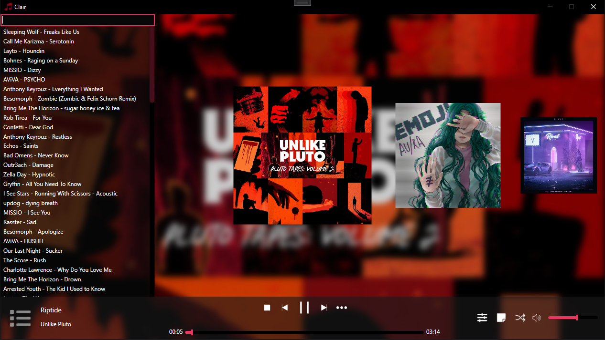

# Clair Musicplayer

## Clair is a musicplayer made in C# using WPF.

## Integrated [Spotify-Downloader](https://github.com/ritiek/spotify-downloader)

## This project is using modified spotdl to run without python.

### Clair Design (1:1):

</img>

## Clair was made with learning purposes in mind but feel free to use it.
