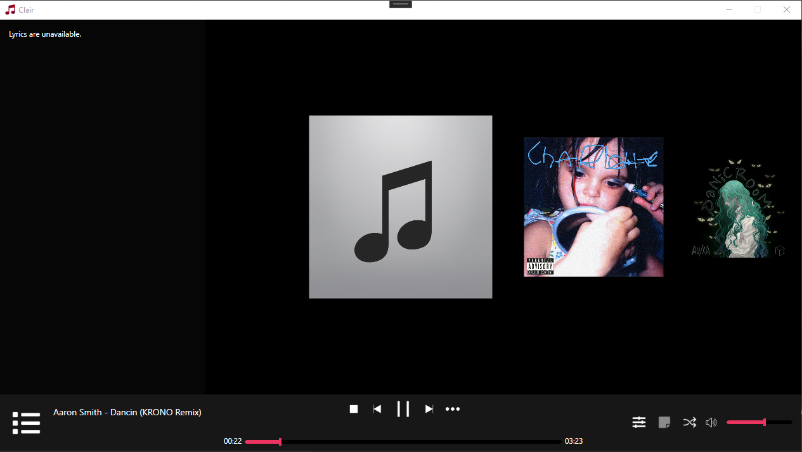

# Clair Musicplayer

### Clair is a musicplayer made in C# using WPF.

### ~~Builtin [Spotify-Downloader](https://github.com/ritiek/spotify-downloader)~~
[Spotify-Downloader](https://github.com/ritiek/spotify-downloader) was removed due to minor issues that came with recent updates. 
[SpotiSharp](http://github.com/L0um15/SpotiSharp) will take place of [Spotify-Downloader](https://github.com/ritiek/spotify-downloader) in the future updates. (Can be downloaded separately) 

### ~~This project is using modified spotdl to run without python (ffmpeg is builtin).~~

### I Highly recommend using **Music Downloader**:
 

</img> 
</img> 
</img> 
</img>

## Clair was created mainly for learning purposes, but now it grew into full project.
